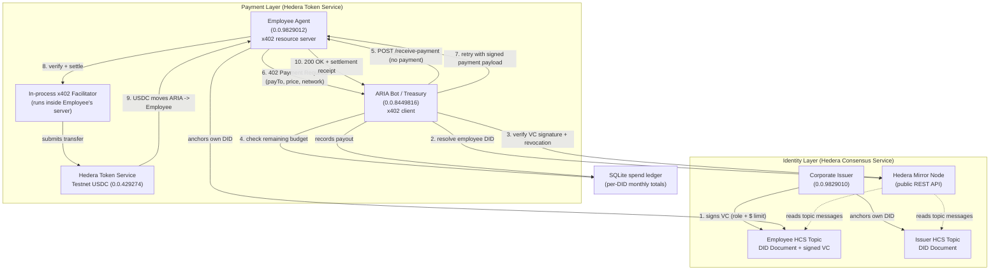
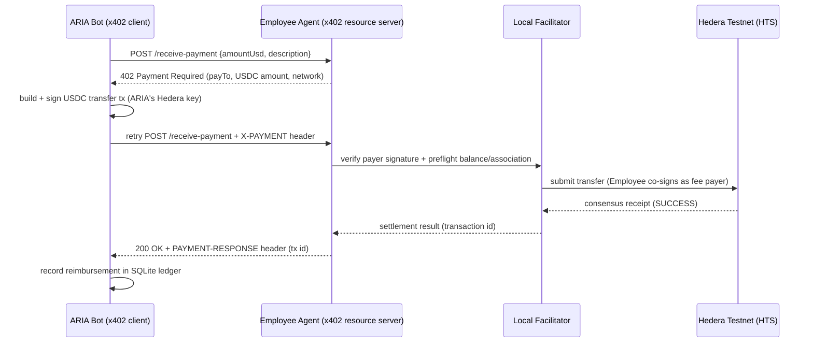

# ARIA — Autonomous Reimbursement & Identity Agent

ARIA lets an AI agent safely spend money on someone else's behalf, without a human in the loop for every payment — by using a decentralized identity/credential trail on Hedera to decide *whether* to pay, and the x402 protocol over Hedera Token Service to actually *move the money*.

## Demo Video

[▶ Watch the demo (MP4)](demo/aria-demo.mp4)


Recorded straight from the terminal against real Hedera Testnet: a $20 reimbursement resolves the employee's DID on HCS, verifies the issuer-signed VC, checks the spend limit, and settles over x402 — followed by a second request that gets rejected once the monthly budget is used up.

## The problem

AI agents can now negotiate, book, and execute tasks autonomously — but the moment one needs to actually spend money (reimburse a $20 receipt, pay for an API call, settle a small invoice), it hits a wall. Legacy payment rails assume a human clicks "approve." Corporate expense reimbursement is a good example: it's bottlenecked by manual approval queues and card/bank rails that have no concept of "verify this requester's identity and authorization programmatically, then pay them in one HTTP round trip."

Two sub-problems have to be solved together for an agent to pay safely:

1. **Who is asking, and are they allowed to spend this much?** — an identity and authorization problem.
2. **Move the money, machine-to-machine, right now.** — a payment-rail problem.

## The solution

ARIA answers (1) with **Decentralized Identifiers (DIDs) and Verifiable Credentials (VCs) anchored on the Hedera Consensus Service (HCS)**, and answers (2) with the **x402 payment protocol over the Hedera Token Service (HTS)**.

Concretely: an employee submits a reimbursement request. ARIA (the treasury agent):

1. Resolves the employee's `did:hedera` identity by replaying their HCS topic through the public mirror node.
2. Verifies a Verifiable Credential — issued and signed by the corporate Issuer, independently checking that signature against the Issuer's *own* DID — asserting the employee's role and monthly spend limit, and checks it hasn't been revoked.
3. Checks a local ledger to make sure this request doesn't exceed what's left of the monthly limit.
4. Only if all three pass: hits the employee's payment endpoint, receives an HTTP `402 Payment Required` challenge per the x402 protocol, and automatically pays it in Testnet USDC over Hedera, in one settled on-chain transaction.

No central database of "who's allowed to spend what" — the credential itself, anchored to HCS, *is* the source of truth, and anyone with mirror-node access can independently verify it. No manual payment approval step — x402 turns "you must pay to proceed" into a machine-readable HTTP handshake.

## Architecture



### The payment handshake in detail



## Why this combination of tech

| Layer | Tech | Why |
|---|---|---|
| Identity | `did:hedera` + W3C-style Verifiable Credentials | Self-sovereign — the employee's authorization lives on their own identity log, not a central "who can spend what" database |
| Anchoring | Hedera Consensus Service (HCS) | Tamper-evident, publicly-replayable event log; anyone can independently re-derive the current DID Document / credential state from the mirror node |
| Payment | x402 protocol (`@x402/*`) | Turns "payment required" into a standard HTTP `402` handshake a machine can complete without a human clicking "approve" |
| Settlement | Hedera Token Service (HTS), Testnet USDC | Fast, cheap, final settlement in a USD-pegged token, natively supported by the x402 Hedera scheme |
| Local policy | SQLite | Simple, durable per-employee monthly spend tracking that backs up the credential's stated limit |

## Project layout

```
src/
  config.ts                 env/config loading, network helpers (HashScan URLs, key parsing)
  hedera/client.ts           Hedera SDK client factories for each actor
  did/did.ts                 did:hedera creation + HCS anchoring + mirror-node resolution
  did/vc.ts                  Verifiable Credential issuance, anchoring, and verification
  db/ledger.ts               SQLite monthly spend ledger
  x402/facilitator.ts        self-hosted, in-process x402 facilitator (verify + settle)
  x402/employeeServer.ts     Employee's x402 resource server (POST /receive-payment)
  x402/ariaAgent.ts          ARIA's x402 client — pays the 402 challenge
  setup/setupAccounts.ts     one-time: creates Issuer + Employee testnet accounts, USDC association
  setup/setupIdentity.ts     one-time: anchors DIDs, issues + anchors the VC
  cli.ts                     interactive demo: simulate an expense request end-to-end
```

## Getting started

### Prerequisites

- Node.js 20+
- A funded Hedera Testnet account for **ARIA** (the treasury bot) — create one via the [Hedera Portal](https://portal.hedera.com)
- Some Testnet USDC in that account, from the [Circle Testnet faucet](https://faucet.circle.com) (select Hedera Testnet) — this is a manual, browser-based step

### Setup

```bash
npm install

cp .env.example .env
# fill in ARIA_ACCOUNT_ID / ARIA_PRIVATE_KEY

npm run setup:accounts   # creates + funds Issuer and Employee testnet accounts, associates USDC
npm run setup:identity   # anchors Issuer + Employee DIDs to HCS, issues + anchors the VC
```

### Run the demo

```bash
npm run cli
```

You'll be prompted for a reimbursement amount and a description. The console prints the full trace: DID resolution, VC verification, spend-limit check, the x402 402-challenge/payment handshake, and a final [HashScan](https://hashscan.io) link to the settled transaction.

## Verified on real Hedera Testnet

This isn't a mock — the flow above has been run end-to-end against Hedera Testnet. Example settled transaction from a $20 reimbursement:

- Transaction: [`0.0.9829012@1785333507.291370163`](https://hashscan.io/testnet/transaction/0.0.9829012@1785333507.291370163)
- Mirror node confirms `result: SUCCESS` with a clean 20 USDC transfer from ARIA (`0.0.8449816`) to the Employee (`0.0.9829012`)

## Notable implementation details / gotchas

- **HCS message chunking**: DID Documents and Verifiable Credentials are larger than a single HCS consensus message, so the Hedera SDK auto-chunks them across multiple mirror-node messages sharing a `chunk_info`. `did.ts` reassembles these before parsing — without it, resolution silently fails.
- **x402 settlement header naming**: despite `X-PAYMENT-RESPONSE` appearing in x402 documentation/examples, `@x402/core`'s Express integration actually sets the response header as `PAYMENT-RESPONSE` (no `X-` prefix). `ariaAgent.ts` reads the correct header name.
- **Self-hosted facilitator**: rather than depending on a third-party x402 facilitator service, the Employee's resource server runs its own in-process facilitator (`x402/facilitator.ts`), verifying payer signatures and preflighting balances directly against the public Hedera mirror node, then settling with its own key as fee payer.
- **Trust separation**: the HCS topic *envelope* signature (proving the topic owner anchored an event) and the Verifiable Credential's own `proof` signature (proving the Corporate Issuer actually issued it) are deliberately independent — `vc.ts` verifies the VC's signature against the Issuer's independently-resolved DID, not against whoever submitted the HCS message.

## What's simplified for this demo

- The facilitator is self-hosted for simplicity rather than a separate trusted third party, which is a valid x402 deployment topology but worth calling out.
- DID Documents follow the shape described in the `did:hedera` method informally rather than implementing the full W3C DID method spec.
- Funding ARIA with Testnet USDC is a manual step (Circle's faucet is a browser-based, human-gated flow).
